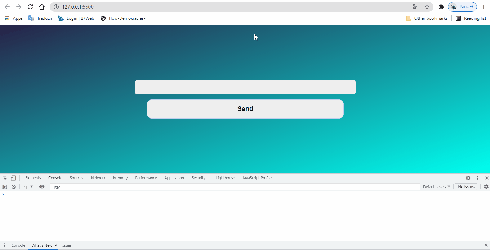

<h1>Revising JS Functionalities</h1>

Recentely, I start to study a new language <kbd>TypeScript</kbd> and to be sure   that I'm be able to learn this I decide to review some <kbd>JavaScript</kbd>   and I saw I've had forgotten many <kbd>events</kbd> like <strong>Click, Key</strong>  
I will put a gif about what I did and learnt as well

<h2>Gif KeyBord Events</h2>

